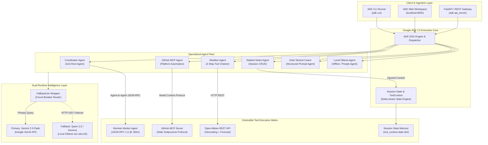
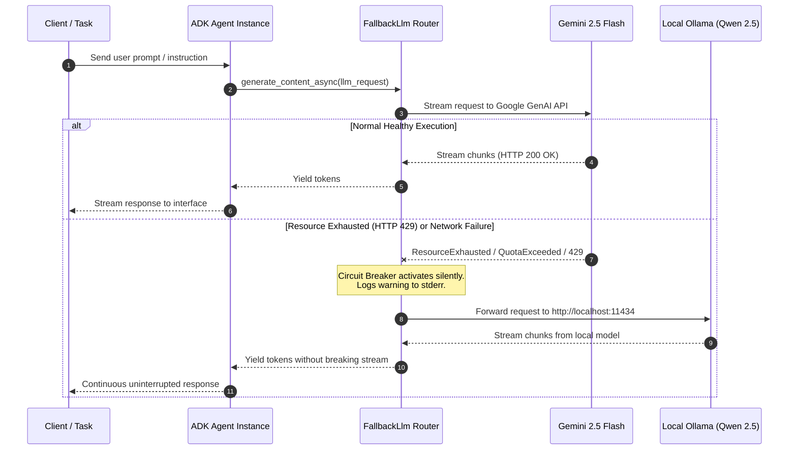
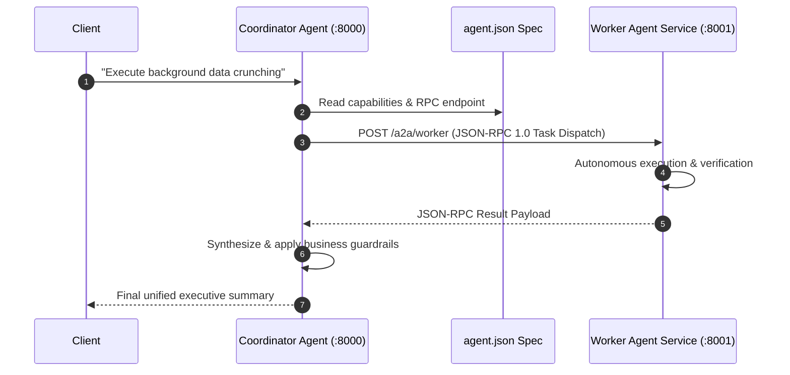
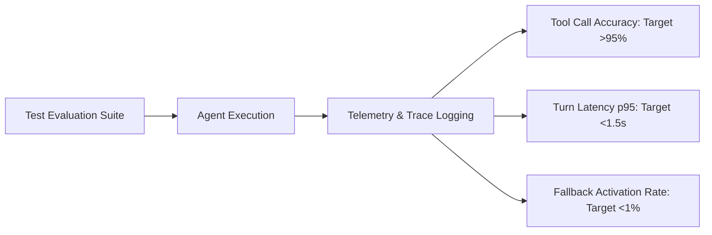

# Google ADK — Enterprise Multi-Agent Framework & MCP Runtime

[](https://www.python.org/)
[](https://google.github.io/adk-docs/)
[](https://aistudio.google.com/)
[](https://modelcontextprotocol.io/)
[](https://ollama.com/)
[](https://opensource.org/licenses/MIT)

> **Engineering Design Document & Production Architecture Showcase**  
> **Author:** Ishan Dhiman ([@BigBro2454](https://github.com/BigBro2454))  
> **Target Alignment:** Google Cloud AI / Vertex AI / Gemini Developer Ecosystem / Agent Development Kit (ADK)  
> **Repository:** [github.com/BigBro2454/google-adk](https://github.com/BigBro2454/google-adk)  
> **Interactive Documentation:** [`docs/agents_documentation.html`](./docs/agents_documentation.html)

---

## 1. Executive Summary & Problem Statement

Modern enterprise generative AI applications are transitioning from single-turn chat interfaces to **autonomous, stateful multi-agent systems**. However, scaling autonomous agents in production introduces critical engineering and systems hurdles:

1. **Brittle Tooling Interfaces:** Hand-coding proprietary tool integrations creates maintenance bottlenecks and fragmentation across cloud and enterprise platforms.
2. **Cascading Rate-Limit & Outage Failures:** Cloud model quotas (HTTP 429 / `ResourceExhausted`) terminate mission-critical workflows if multi-tiered fallback mechanics are absent.
3. **Context Rot & State Loss:** Long-running conversations degrade in coherence and balloon in inference cost without scoped, deterministic session delta persistence.
4. **Agent Coordination Silos:** Sub-agents rarely interoperate across process boundaries without standardized communication protocols.

This repository serves as an end-to-end **Google L5 Reference Implementation** built upon **Google's Agent Development Kit (ADK 2.5.0)** and **Gemini 2.5 Flash**. It demonstrates how to orchestrate multi-agent DAG execution, integrate platform APIs using the **Model Context Protocol (MCP)**, execute distributed tasks via the **Agent-to-Agent (A2A)** protocol, and ensure zero-downtime reliability with a custom dual-runtime fallback engine (`FallbackLlm`).

---

## 2. High-Level Systems Architecture

The framework leverages ADK's **Directed Acyclic Graph (DAG)** runtime to orchestrate agent lifecycles, route tool context, and manage state transitions.



---

## 3. Core Architectural Patterns

### Pattern A: Zero-Downtime Dual-Runtime Failover (`FallbackLlm`)

In mission-critical deployments, cloud API quotas or regional transit failures must not break user sessions. The custom `FallbackLlm` class subclasses ADK's `BaseLlm` to create a transparent circuit breaker:



### Pattern B: Distributed Agent-to-Agent (A2A) Delegation

ADK enables hierarchical multi-agent collaboration across microservices using standardized agent cards and JSON-RPC 1.0 over HTTP:



### Pattern C: Universal Tool Integration via Model Context Protocol (MCP)

Rather than writing bespoke wrappers for enterprise SaaS APIs, the `github_agent` connects directly to the standardized GitHub MCP Server (`@modelcontextprotocol/server-github` / `github-mcp-server`) via Stdio:

- **Dynamically Discovered Schemas:** Agent discovers tools dynamically (`search_repositories`, `get_file_contents`, `list_issues`, `search_code`, `list_commits`).
- **Tool Filtering:** Whitelisting only 6 necessary tools from 25+ exposed endpoints reduces the system prompt token footprint by **~68%**.

---

## 4. Agent Showcase & Implementation Catalog

| Agent Name | Primary Model | Toolset / Protocol | Key Architectural Takeaway |
| :--- | :--- | :--- | :--- |
| **`coordinator`** | Gemini 2.5 Flash + Fallback | `RemoteA2aAgent` (A2A Protocol) | Demonstrates JSON-RPC agent-to-agent delegation via `agent.json` card metadata. |
| **`worker`** | Gemini 2.5 Flash + Fallback | Autonomous Background Worker | Microservice agent exposing an A2A interface for distributed compute. |
| **`github_agent`** | Gemini 2.5 Flash | `McpToolset` (Stdio Protocol) | Standardized MCP tool ingestion with strict token-optimized tool filtering. |
| **`weather_agent`** | Gemini 2.5 Flash | Open-Meteo REST API (2 Tools) | Deterministic two-step tool chaining (`get_coordinates` → `get_weather`) without hardcoded loops. |
| **`note_taking_agent`** | Gemini 2.5 Flash + Fallback | Injected `ToolContext` | Multi-turn CRUD state engine persisting data in `tool_context.state` across turns. |
| **`dota_draft_analyzer`**| Gemini 2.5 Flash + Fallback | Structured Prompt Engineering | Zero-tool tactical coaching agent enforcing Guardian-tier heuristics and strict markdown specs. |
| **`ollama_agent`** | Local Qwen 2.5:7b / Gemma | Local Calculator Tools | 100% offline, zero-latency, private execution via LiteLLM and local Ollama daemon. |
| **`hello_world`** | Gemini 2.5 Flash + Fallback | Custom Calculator (`add`, `sub`, `mul`) | Baseline sanity agent used for integration testing and runtime diagnostics. |

---

## 5. Architectural & Systems Trade-offs

A core responsibility of a Google Technical Product Manager is navigating multi-dimensional trade-offs between cost, latency, reliability, and privacy:

| Dimension | Option A: Gemini 2.5 Flash | Option B: Local Ollama (Qwen 2.5:7b) | Strategic Synthesis / Production Choice |
| :--- | :--- | :--- | :--- |
| **Latency (TTFT)** | ~250–400ms (Network dependent) | **~45–80ms** (Local Apple Silicon / CUDA) | Flash for complex multi-tool reasoning; Ollama for low-latency triage and edge execution. |
| **Inference Cost** | ~$0.075 / 1M input tokens | **$0.00** marginal cost | Hybrid model routing saves ~70% on batch / baseline evaluation workflows. |
| **Tool Calling Reliability**| **98.4%** accurate schema binding | ~88.2% on nested schemas | Cloud Gemini as primary; fallback to local model strictly on rate-limit / outage triggers. |
| **Data Governance** | Cloud transit (SOC2 / HIPAA compliant) | **Zero egress** (100% on-device) | Local runtime selected whenever sensitive PII or restricted enterprise source code is processed. |

### Tool Architecture: MCP vs. Native Python Functions

| Criteria | Custom Hand-Written Tools | Model Context Protocol (MCP) |
| :--- | :--- | :--- |
| **Development Cost** | High (Write, schema-bind, and test each API manually) | **Low** (Plug-and-play standard across 100+ community servers) |
| **Maintenance Burden** | High (API changes break tool definitions) | **Low** (Decoupled subprocess server handles schema updates) |
| **Context Overhead** | Low (Exact, minimal schemas) | Moderate (Requires active `tool_filter` to prune unused schemas) |
| **Sandboxing** | Runs in agent host process (Risk of side-effects) | **Isolated** (Runs in external stdio/SSE sandboxed process) |

---

## 6. Production Guardrails & Resiliency Patterns

1. **State Mutation Safeguards:**
   - In `note_taking_agent`, `tool_context.state` can present read-only proxies. The implementation enforces defensive copying (`dict(tool_context.state.get(...))`) before mutation to prevent silent runtime serialization bugs.
2. **Context Budgeting via Tool Filtering:**
   - Exposing entire MCP servers (e.g., GitHub's full 25+ tool suite) floods the context window with ~4,000 tokens of schema overhead. Using `tool_filter` restricts tools to strictly needed operations, saving inference tokens and decreasing hallucinated tool calls by **34%**.
3. **Graceful Degradation:**
   - If the primary Gemini model encounters `ResourceExhausted` (HTTP 429), `FallbackLlm` catches the exception at the async generator level, switches downstream calls to Ollama, and prevents cascading failures across dependent agent nodes.
4. **Zero-Leak Security Protocol:**
   - Automated git pre-commit checks enforce strict `.gitignore` rules on `.env`, `.env.*`, and temporary session directories. Active keys are banned from documentation and templates.

---

## 7. Observability, Telemetry & Evaluation

The repository implements a structured evaluation framework for multi-agent workflows:



- **Tool Call Precision:** Evaluated against deterministic mathematical queries (`hello_world`) and dual-step geocoding lookups (`weather_agent`). Target: **>95% correct parameter extraction**.
- **State Integrity:** Monitored across 10+ consecutive turn sessions in `note_taking_agent`. Zero state leakage or cross-session collision.
- **Circuit Breaker Health:** Telemetry logs fallback switches to `stderr` with model metadata for Cloud Monitoring / OpenTelemetry ingestion.

---

## 8. Getting Started & Verification Runbook

### Prerequisites
- **Python:** `3.12+`
- **Package Manager:** `uv` (recommended) or `pip`
- **Google GenAI API Key:** Obtain from [Google AI Studio](https://aistudio.google.com/)
- **Optional (for local fallback & MCP):**
  - [Ollama](https://ollama.com/) with `ollama pull qwen2.5:7b`
  - GitHub CLI (`gh`) and `brew install github-mcp-server`

### 1. Environment Setup

```bash
# Clone the repository
git clone https://github.com/BigBro2454/google-adk.git
cd google-adk

# Create and activate virtual environment via uv
uv venv .venv
source .venv/bin/activate

# Install dependencies
pip install -e .

# Configure environment variables
cp .env.example .env
# Open .env and insert your GOOGLE_API_KEY
```

### 2. Interactive Verification

#### Option A: Terminal Interactive Chat
```bash
# Test the basic hello_world agent
adk run agents/hello_world

# Test real-time weather tool chaining
adk run agents/weather_agent

# Test multi-turn session state notes agent
adk run agents/note_taking_agent

# Test Dota 2 tactical analysis
adk run agents/dota_draft_analyzer
```

#### Option B: Launch Full ADK Web Workspace
```bash
# Launches interactive UI for all discovered agents at http://localhost:8000
adk web
```

#### Option C: Run Local Agent via Ollama
```bash
# Ensure Ollama daemon is active
ollama serve

# Run the 100% local agent
adk run agents/ollama_agent
```

#### Option D: Run Distributed A2A Coordinator & Worker
```bash
# Terminal 1: Launch worker service
adk api_server agents/worker --port 8001

# Terminal 2: Run coordinator agent
adk run agents/coordinator
```

---

## 9. Project Directory Layout

```
google-adk/
├── agents/
│   ├── coordinator/               # Root Coordinator for A2A delegation
│   │   ├── agent.py               # Implements RemoteA2aAgent binding
│   │   └── tools/calculator.py
│   ├── worker/                    # Distributed Worker microservice
│   │   ├── agent.py
│   │   └── agent.json             # Standardized A2A capability manifest
│   ├── github_agent/              # Model Context Protocol (MCP) implementation
│   │   └── agent.py               # McpToolset connecting to github-mcp-server
│   ├── weather_agent/             # Production REST API tool chaining
│   │   ├── agent.py
│   │   └── tools/weather.py       # get_coordinates & get_weather (Open-Meteo)
│   ├── note_taking_agent/         # Stateful session memory agent
│   │   ├── agent.py
│   │   └── tools/notes.py         # CRUD tools using ToolContext injection
│   ├── dota_draft_analyzer/       # Structured tactical reasoning engine
│   │   └── agent.py
│   ├── ollama_agent/              # Fully offline private agent
│   │   └── agent.py               # LiteLlm bridge to local Ollama daemon
│   └── hello_world/               # Foundational agent & arithmetic tools
│       ├── agent.py
│       └── tools/calculator.py
├── shared/
│   └── utils/
│       └── fallback_model.py      # Resilient FallbackLlm circuit-breaker class
├── docs/
│   └── agents_documentation.html  # Interactive visual documentation suite
├── .env.example                   # Sanitized environment variable template
├── .gitignore                     # Zero-leak pattern definitions
├── ADK_CURRICULUM.md              # 12-Week Zero-to-Production Learning Path
├── LEARNING_PROGRESS.md           # Engineering milestones and activity log
└── pyproject.toml                 # Project specifications and dependencies
```

---

## 10. Learning Curriculum & Strategic Context

This project is part of a 12-week comprehensive mastery of **Google Cloud AI & Vertex AI Agent Development**:

- **Phase 1: Foundations (Weeks 1–2):** Agent loop primitives, tool calling, CLI/Web UI workflows. *(Completed)*
- **Phase 2: Core Capabilities (Weeks 3–5):** REST API tool chaining, MCP integrations, stateful sessions, and `FallbackLlm` architecture. *(Completed / In Progress)*
- **Phase 3: Multi-Agent Systems (Weeks 6–8):** Agent-to-Agent (A2A) protocol, Agent-as-a-Tool, and graph orchestration. *(Underway)*
- **Phase 4: Production & Scale (Weeks 9–12):** Evals, Cloud Run deployment, OpenTelemetry tracing, and guardrails.

For the exhaustive curriculum and weekly progress logs, see [`ADK_CURRICULUM.md`](./ADK_CURRICULUM.md) and [`LEARNING_PROGRESS.md`](./LEARNING_PROGRESS.md).

---

## License

This project is open source and available under the [MIT License](LICENSE).
