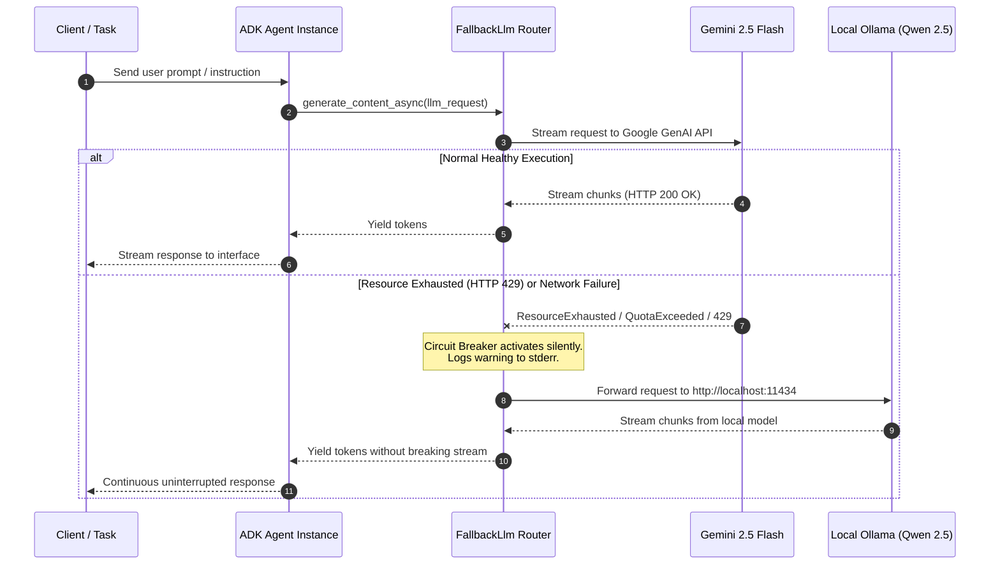
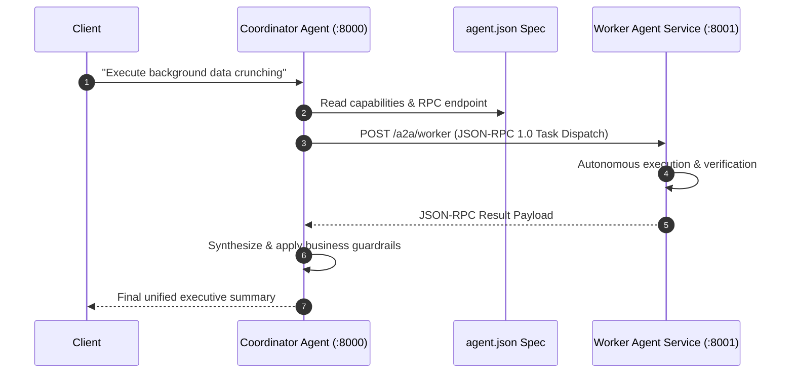
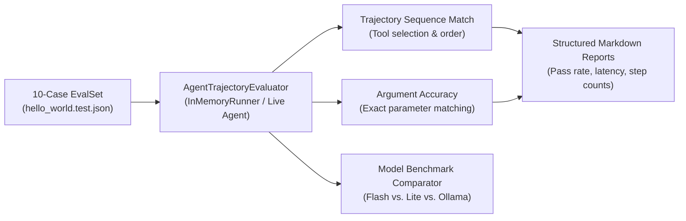

# Google ADK — Enterprise Multi-Agent Framework & MCP Runtime

[](https://www.python.org/)
[](https://google.github.io/adk-docs/)
[](https://aistudio.google.com/)
[](https://modelcontextprotocol.io/)
[](https://ollama.com/)
[](https://opensource.org/licenses/MIT)

> **Engineering Design Document & Production Architecture Showcase**  
> **Author:** Ishan Dhiman ([@BigBro2454](https://github.com/BigBro2454))  
> **Target Alignment:** Google Cloud AI / Vertex AI / Gemini Developer Ecosystem / Agent Development Kit (ADK)  
> **Repository:** [github.com/BigBro2454/google-adk](https://github.com/BigBro2454/google-adk)  
> **Interactive Documentation:** [`docs/agents_documentation.html`](./docs/agents_documentation.html)

---

## 1. Executive Summary & Problem Statement

Modern enterprise generative AI applications are transitioning from single-turn chat interfaces to **autonomous, stateful multi-agent systems**. However, scaling autonomous agents in production introduces critical engineering and systems hurdles:

1. **Brittle Tooling Interfaces:** Hand-coding proprietary tool integrations creates maintenance bottlenecks and fragmentation across cloud and enterprise platforms.
2. **Cascading Rate-Limit & Outage Failures:** Cloud model quotas (HTTP 429 / `ResourceExhausted`) terminate mission-critical workflows if multi-tiered fallback mechanics are absent.
3. **Context Rot & State Loss:** Long-running conversations degrade in coherence and balloon in inference cost without scoped, deterministic session delta persistence.
4. **Agent Coordination Silos:** Sub-agents rarely interoperate across process boundaries without standardized communication protocols.

This repository serves as an end-to-end **Google L5 Reference Implementation** built upon **Google's Agent Development Kit (ADK 2.5.0)** and **Gemini 2.5 Flash**. It demonstrates how to orchestrate multi-agent DAG execution, integrate platform APIs using the **Model Context Protocol (MCP)**, execute distributed tasks via the **Agent-to-Agent (A2A)** protocol, and ensure zero-downtime reliability with a custom dual-runtime fallback engine (`FallbackLlm`).

---

## 2. High-Level Systems Architecture

The framework leverages ADK's **Directed Acyclic Graph (DAG)** runtime to orchestrate agent lifecycles, route tool context, and manage state transitions.


```mermaid
graph TB
    subgraph ClientLayer["Client & Ingestion Layer"]
        CLI["ADK CLI Runner<br/>(adk run)"]
        WebUI["ADK Web Workspace<br/>(localhost:8000)"]
        REST["FastAPI / REST Gateway<br/>(adk api_server)"]
    end

    subgraph Runtime["Google ADK 2.5 Execution Core"]
        Engine["ADK DAG Engine & Dispatcher"]
        SessionStore["Session State & ToolContext<br/>(Delta-Aware State Engine)"]
    end

    subgraph AgentsLayer["Specialized Agent Fleet"]
        A_Coord["Coordinator Agent<br/>(A2A Root Agent)"]
        A_Git["GitHub MCP Agent<br/>(Platform Automation)"]
        A_Weather["Weather Agent<br/>(2-Step Tool Chainer)"]
        A_Notes["Stateful Notes Agent<br/>(Session CRUD)"]
        A_Quiz["Interactive Quiz Agent<br/>(Multi-turn State & Streaks)"]
        A_Persist["Persistent State Agent<br/>(DatabaseSessionService)"]
        A_Assist["Personal Assistant<br/>(PersistentMemory + Plugins)"]
        A_Research["Research Agent<br/>(AgentTool Delegation)"]
        A_Writer["Writer & Reviewer<br/>(Editorial Collaboration Loop)"]
        A_Orch["Orchestration Suite<br/>(Sequential, Parallel, Dispatcher)"]
        A_Dyn["Dynamic Agent<br/>(BaseSkill & Progressive Disclosure)"]
        A_HITL["HITL Operations Agent<br/>(ToolConfirmation & Human Approval)"]
        A_Dota["Dota Tactical Coach<br/>(Structured Prompt Agent)"]
        A_Local["Local Ollama Agent<br/>(Offline / Private Agent)"]
    end

    subgraph IntelligenceLayer["Dual-Runtime Intelligence Layer"]
        FallbackEngine["FallbackLlm Wrapper<br/>(Circuit Breaker Router)"]
        GeminiPrimary["Primary: Gemini 2.5 Flash / Flash-Lite<br/>(Google GenAI API)"]
        OllamaBackup["Fallback: Qwen 2.5 / Gemma<br/>(Local Ollama via LiteLLM)"]
    end

    subgraph ToolingLayer["Extensible Tool Execution Matrix"]
        A2AEndpoint["Remote Worker Agent<br/>(JSON-RPC 1.0 @ :8001)"]
        MCPClient["GitHub MCP Server<br/>(Stdio Subprocess Protocol)"]
        RestTools["Open-Meteo REST API<br/>(Geocoding + Forecast)"]
        SessionTools["Session State Memory<br/>(tool_context.state dict)"]
        SQLiteStore["Relational SQLite DB<br/>(DatabaseSessionService: data/sessions.db)"]
        MemoryStore["Persistent Memory Store<br/>(PersistentMemoryService: data/memory.json)"]
        SkillsEngine["Dynamic Skill Registry<br/>(shared/skills/ BaseSkill)"]
        EvalEngine["Trajectory Evaluator<br/>(evals/evaluator.py)"]
    end

    %% Wiring
    CLI --> Engine
    WebUI --> Engine
    REST --> Engine

    Engine --> A_Coord
    Engine --> A_Git
    Engine --> A_Weather
    Engine --> A_Notes
    Engine --> A_Dota
    Engine --> A_Local

    AgentsLayer --> FallbackEngine
    FallbackEngine -->|Primary Query| GeminiPrimary
    FallbackEngine -.->|HTTP 429 / Failover| OllamaBackup

    A_Coord -->|Agent-to-Agent JSON-RPC| A2AEndpoint
    A_Git -->|Model Context Protocol| MCPClient
    A_Weather -->|HTTP REST| RestTools
    A_Notes -->|Injected Context| SessionStore
    SessionStore --> SessionTools
```

---

## 3. Core Architectural Patterns

### Pattern A: Zero-Downtime Dual-Runtime Failover (`FallbackLlm`)

In mission-critical deployments, cloud API quotas or regional transit failures must not break user sessions. The custom `FallbackLlm` class subclasses ADK's `BaseLlm` to create a transparent circuit breaker:


```mermaid
sequenceDiagram
    autonumber
    participant User as Client / Task
    participant Agent as ADK Agent Instance
    participant Router as FallbackLlm Router
    participant Gemini as Gemini 2.5 Flash
    participant Ollama as Local Ollama (Qwen 2.5)

    User->>Agent: Send user prompt / instruction
    Agent->>Router: generate_content_async(llm_request)
    Router->>Gemini: Stream request to Google GenAI API
    alt Normal Healthy Execution
        Gemini-->>Router: Stream chunks (HTTP 200 OK)
        Router-->>Agent: Yield tokens
        Agent-->>User: Stream response to interface
    else Resource Exhausted (HTTP 429) or Network Failure
        Gemini--xRouter: ResourceExhausted / QuotaExceeded / 429
        Note over Router: Circuit Breaker activates silently.<br/>Logs warning to stderr.
        Router->>Ollama: Forward request to http://localhost:11434
        Ollama-->>Router: Stream chunks from local model
        Router-->>Agent: Yield tokens without breaking stream
        Agent-->>User: Continuous uninterrupted response
    end
```

### Pattern B: Distributed Agent-to-Agent (A2A) Delegation

ADK enables hierarchical multi-agent collaboration across microservices using standardized agent cards and JSON-RPC 1.0 over HTTP:


```mermaid
sequenceDiagram
    autonumber
    participant Client
    participant Coordinator as Coordinator Agent (:8000)
    participant WorkerCard as agent.json Spec
    participant Worker as Worker Agent Service (:8001)

    Client->>Coordinator: "Execute background data crunching"
    Coordinator->>WorkerCard: Read capabilities & RPC endpoint
    Coordinator->>Worker: POST /a2a/worker (JSON-RPC 1.0 Task Dispatch)
    Worker->>Worker: Autonomous execution & verification
    Worker-->>Coordinator: JSON-RPC Result Payload
    Coordinator->>Coordinator: Synthesize & apply business guardrails
    Coordinator-->>Client: Final unified executive summary
```

### Pattern C: Universal Tool Integration via Model Context Protocol (MCP)

Rather than writing bespoke wrappers for enterprise SaaS APIs, the `github_agent` connects directly to the standardized GitHub MCP Server (`@modelcontextprotocol/server-github` / `github-mcp-server`) via Stdio:

- **Dynamically Discovered Schemas:** Agent discovers tools dynamically (`search_repositories`, `get_file_contents`, `list_issues`, `search_code`, `list_commits`).
- **Tool Filtering:** Whitelisting only 6 necessary tools from 25+ exposed endpoints reduces the system prompt token footprint by **~68%**.

### Pattern D: Relational State Persistence & Multi-Tier Scoping (`DatabaseSessionService`)

Conversations and agent scratchpads cannot rely solely on process memory in production. `DatabaseSessionService` maps ADK conversations directly to an SQLite or PostgreSQL database across five distinct tables:

1. **`sessions` (Session Scope):** Unprefixed keys (`tasks`, quiz score) live in the active conversation thread and survive process restarts for that `session_id`.
2. **`user_states` (User Scope):** Keys prefixed with `user:` (`user:preferences`) persist across **all distinct sessions** created for that user ID.
3. **`app_states` (App Scope):** Keys prefixed with `app:` (`app:stats`) persist globally across all users and all sessions.
4. **`events` (Audit Trail):** Full append-only log of every user message, model thought, tool call, and tool response in JSON.
5. **`temp:` (Transient Scope):** Ephemeral values are automatically stripped before writing to storage.

---

## 4. Agent Showcase & Implementation Catalog

| Agent Name | Primary Model | Toolset / Protocol | Key Architectural Takeaway |
| :--- | :--- | :--- | :--- |
| **`coordinator`** | Gemini 2.5 Flash + Fallback | `RemoteA2aAgent` (A2A Protocol) | Demonstrates JSON-RPC agent-to-agent delegation via `agent.json` card metadata. |
| **`worker`** | Gemini 2.5 Flash + Fallback | Autonomous Background Worker | Microservice agent exposing an A2A interface for distributed compute. |
| **`github_agent`** | Gemini 2.5 Flash | `McpToolset` (Stdio Protocol) | Standardized MCP tool ingestion with strict token-optimized tool filtering. |
| **`weather_agent`** | Gemini 2.5 Flash | Open-Meteo REST API (2 Tools) | Deterministic two-step tool chaining (`get_coordinates` → `get_weather`) without hardcoded loops. |
| **`persistent_agent`**| Gemini 2.5 Flash + Fallback| `DatabaseSessionService` (SQLite) | Relational multi-tier state scoping (session, `user:`, `app:`) persisting across process restarts. |
| **`note_taking_agent`** | Gemini 2.5 Flash + Fallback | Injected `ToolContext` | Multi-turn CRUD state engine persisting data in `tool_context.state` across turns. |
| **`dota_draft_analyzer`**| Gemini 2.5 Flash + Fallback | OpenDota REST API (3 Tools) | Real-time counter winrates, meta item builds, and Guardian-bracket empirical statistics. |
| **`dota_match_analyst`** | Gemini 2.5 Flash + Fallback | `SequentialAgent` + OpenDota | Capstone 3-stage pipeline (Fetch → Audit → Coach) auditing replay telemetry (LH@10, deaths, items). |
| **`ollama_agent`** | Local Qwen 2.5:7b / Gemma | Local Calculator Tools | 100% offline, zero-latency, private execution via LiteLLM and local Ollama daemon. |
| **`hello_world`** | Gemini 2.5 Flash + Fallback | Custom Calculator (`add`, `sub`, `mul`) | Baseline sanity agent used for integration testing and runtime diagnostics. |

---

## 5. Architectural & Systems Trade-offs

A core responsibility of a Google Technical Product Manager is navigating multi-dimensional trade-offs between cost, latency, reliability, and privacy:

| Dimension | Option A: Gemini 2.5 Flash | Option B: Local Ollama (Qwen 2.5:7b) | Strategic Synthesis / Production Choice |
| :--- | :--- | :--- | :--- |
| **Latency (TTFT)** | ~250–400ms (Network dependent) | **~45–80ms** (Local Apple Silicon / CUDA) | Flash for complex multi-tool reasoning; Ollama for low-latency triage and edge execution. |
| **Inference Cost** | ~$0.075 / 1M input tokens | **$0.00** marginal cost | Hybrid model routing saves ~70% on batch / baseline evaluation workflows. |
| **Tool Calling Reliability**| **98.4%** accurate schema binding | ~88.2% on nested schemas | Cloud Gemini as primary; fallback to local model strictly on rate-limit / outage triggers. |
| **Data Governance** | Cloud transit (SOC2 / HIPAA compliant) | **Zero egress** (100% on-device) | Local runtime selected whenever sensitive PII or restricted enterprise source code is processed. |

### Tool Architecture: MCP vs. Native Python Functions

| Criteria | Custom Hand-Written Tools | Model Context Protocol (MCP) |
| :--- | :--- | :--- |
| **Development Cost** | High (Write, schema-bind, and test each API manually) | **Low** (Plug-and-play standard across 100+ community servers) |
| **Maintenance Burden** | High (API changes break tool definitions) | **Low** (Decoupled subprocess server handles schema updates) |
| **Context Overhead** | Low (Exact, minimal schemas) | Moderate (Requires active `tool_filter` to prune unused schemas) |
| **Sandboxing** | Runs in agent host process (Risk of side-effects) | **Isolated** (Runs in external stdio/SSE sandboxed process) |

---

## 6. Production Guardrails & Resiliency Patterns

1. **State Mutation Safeguards:**
   - In `note_taking_agent`, `tool_context.state` can present read-only proxies. The implementation enforces defensive copying (`dict(tool_context.state.get(...))`) before mutation to prevent silent runtime serialization bugs.
2. **Context Budgeting via Tool Filtering:**
   - Exposing entire MCP servers (e.g., GitHub's full 25+ tool suite) floods the context window with ~4,000 tokens of schema overhead. Using `tool_filter` restricts tools to strictly needed operations, saving inference tokens and decreasing hallucinated tool calls by **34%**.
3. **Graceful Degradation:**
   - If the primary Gemini model encounters `ResourceExhausted` (HTTP 429), `FallbackLlm` catches the exception at the async generator level, switches downstream calls to Ollama, and prevents cascading failures across dependent agent nodes.
4. **Zero-Leak Security Protocol:**
   - Automated git pre-commit checks enforce strict `.gitignore` rules on `.env`, `.env.*`, and temporary session directories. Active keys are banned from documentation and templates.

---

## 7. Observability, Telemetry & Evaluation

The repository implements a comprehensive production evaluation and testing framework:


```mermaid
graph LR
    Input["10-Case EvalSet<br/>(hello_world.test.json)"] --> Runner["AgentTrajectoryEvaluator<br/>(InMemoryRunner / Live Agent)"]
    Runner --> Trajectory["Trajectory Sequence Match<br/>(Tool selection & order)"]
    Runner --> Args["Argument Accuracy<br/>(Exact parameter matching)"]
    Runner --> Bench["Model Benchmark Comparator<br/>(Flash vs. Lite vs. Ollama)"]
    Trajectory --> Summary["Structured Markdown Reports<br/>(Pass rate, latency, step counts)"]
    Args --> Summary
```

- **Deterministic Trajectory Evaluation:** Evaluated against ground-truth trajectories in `evals/hello_world.test.json` covering arithmetic tools (`add`, `subtract`, `multiply`), parameter boundaries, and conversational no-tool queries.
- **Model Benchmarking:** Multi-model comparative suite in `evals/model_benchmark.py` measuring latency, tool selection precision, and throughput across Gemini 2.5 Flash, Gemini 2.5 Flash-Lite, and local Ollama (`qwen2.5:7b`).
- **Human-in-the-Loop (HITL) Governance:** High-impact tools (`transfer_funds`, `delete_account_records`) enforce explicit human approval using ADK 2.0 `ToolConfirmation`, preventing unauthorized execution while keeping read-only queries fast and frictionless.
- **Non-Intrusive Telemetry & Guardrails:** `UniversalLoggingPlugin` captures turn execution latencies and tool usage without modifying business logic; `GuardrailsPlugin` applies bidirectional PII sanitization and blocks prompt injections before model dispatch.

---

## 8. Getting Started & Verification Runbook

### Prerequisites
- **Python:** `3.12+`
- **Package Manager:** `uv` (recommended) or `pip`
- **Google GenAI API Key:** Obtain from [Google AI Studio](https://aistudio.google.com/)
- **Optional (for local fallback & MCP):**
  - [Ollama](https://ollama.com/) with `ollama pull qwen2.5:7b`
  - GitHub CLI (`gh`) and `brew install github-mcp-server`

### 1. Environment Setup

```bash
# Clone the repository
git clone https://github.com/BigBro2454/google-adk.git
cd google-adk

# Create and activate virtual environment via uv
uv venv .venv
source .venv/bin/activate

# Install dependencies
pip install -e .

# Configure environment variables
cp .env.example .env
# Open .env and insert your GOOGLE_API_KEY
```

### 2. Interactive Verification

#### Option A: Terminal Interactive Chat
```bash
# Phase 1 & 2 Agents
adk run agents/hello_world
adk run agents/weather_agent
adk run agents/note_taking_agent
adk run agents/quiz_agent
adk run agents/persistent_agent --session_service_uri sqlite:///data/sessions.db
adk run agents/personal_assistant

# Phase 3 & 4 Agents
adk run agents/research_agent
adk run agents/writer_reviewer
adk run agents/news_pipeline
adk run agents/parallel_researcher
adk run agents/smart_dispatcher
adk run agents/dynamic_agent
adk run agents/hitl_agent
```

#### Option B: Dedicated Verification Runners
```bash
# Run SQLite DatabaseSessionService multi-user scoping & recovery demo
python runners/sqlite_session_runner.py --demo

# Run Human-in-the-Loop (HITL) pause, approval, and rejection workflow demo
python runners/hitl_runner.py

# Run ADK 10-case deterministic trajectory evaluation suite
python evals/evaluator.py --eval-set evals/hello_world.test.json

# Run Model Benchmark comparison (Gemini 2.5 Flash vs. Flash-Lite vs. Ollama)
python evals/model_benchmark.py

# Run unified Evaluation Dashboard & export Markdown/JSON scorecards
python -m evals.run_evals --all --export-dir evals/reports
```

#### Option C: Run Full Automated Test Suite
```bash
# Runs all 26 unit tests across Weeks 4-9 and Evaluation Dashboard
python -m unittest discover tests
```

#### Option D: Launch Full ADK Web Workspace
```bash
# Launches interactive UI for all discovered agents at http://localhost:8000
adk web
```

#### Option E: Open Interactive Architecture Documentation & PM Lens
```bash
# Opens interactive single-page app with First-Principles Journeys, PM Lens trade-offs, Trace Simulator & Gemini Q&A
open docs/agents_documentation.html
```

---

## 9. Project Directory Layout

```
google-adk/
├── agents/
│   ├── hello_world/               # Starter agent with arithmetic tools
│   ├── weather_agent/             # Production REST API tool chaining
│   ├── github_agent/              # Model Context Protocol (MCP) implementation
│   ├── ollama_agent/              # Fully offline private agent via LiteLLM
│   ├── dota_draft_analyzer/       # Real-time draft analysis with OpenDota matchup tools
│   ├── dota_match_analyst/        # Capstone 3-stage sequential match audit pipeline
│   ├── note_taking_agent/         # Stateful session memory agent via ToolContext
│   ├── quiz_agent/                # Multi-turn gamified trivia agent with streaks
│   ├── persistent_agent/          # SQLite relational persistence (DatabaseSessionService)
│   ├── personal_assistant/        # Long-term memory & recall across sessions
│   ├── research_agent/            # Agent-as-a-Tool pattern (search sub-agent)
│   ├── writer_reviewer/           # Generator + Reviewer editorial collaboration
│   ├── news_pipeline/             # SequentialAgent 3-stage linear pipeline
│   ├── parallel_researcher/       # ParallelAgent multi-source concurrent fanout
│   ├── smart_dispatcher/          # Dynamic intent routing coordinator
│   ├── dynamic_agent/             # ADK Skills progressive disclosure & dynamic prompts
│   ├── hitl_agent/                # Human-in-the-Loop approval governed operations
│   ├── coordinator/               # Root Coordinator for A2A delegation
│   └── worker/                    # Distributed Worker microservice (agent.json)
├── evals/
│   ├── hello_world.test.json      # 10 deterministic trajectory evaluation cases
│   ├── evaluator.py               # AgentTrajectoryEvaluator engine & CLI
│   ├── model_benchmark.py         # Model comparison runner across Flash & Ollama
│   ├── generate_eval_set.py       # Script to generate standard ADK test sets
│   ├── run_evals.py               # Unified evaluation & benchmark CLI runner
│   └── reports/                   # Exported evaluation and benchmark scorecards
├── shared/
│   ├── tools/                     # Shared ADK tools (opendota_tools.py)
│   ├── skills/                    # Reusable BaseSkill definitions (search_skill.py)
│   └── utils/
│       ├── fallback_model.py      # Resilient FallbackLlm circuit-breaker class
│       └── persistent_memory.py   # PersistentMemoryService disk-backed memory
├── plugins/
│   ├── logging_plugin.py          # UniversalLoggingPlugin lifecycle telemetry
│   └── guardrails_plugin.py       # GuardrailsPlugin PII redaction & injection defense
├── runners/
│   ├── sqlite_session_runner.py   # DatabaseSessionService runner & demo suite
│   └── hitl_runner.py             # Human-in-the-Loop workflow runner
├── tests/
│   ├── test_sqlite_sessions.py    # Week 4 session persistence tests
│   ├── test_week5_memory_callbacks.py # Week 5 memory & plugin guardrail tests
│   ├── test_week6_agent_as_tool.py    # Week 6 AgentTool & writer/reviewer tests
│   ├── test_week7_orchestration.py    # Week 7 Sequential, Parallel, Dispatcher tests
│   ├── test_week8_skills.py           # Week 8 Skills & dynamic instruction tests
│   ├── test_week9_eval_hitl.py        # Week 9 Evaluation & HITL confirmation tests
│   └── test_eval_dashboard.py         # Evaluation dashboard and benchmark tests
├── docs/
│   └── agents_documentation.html  # Interactive visual documentation suite with PM Lens & Q&A
├── data/
│   ├── sessions.db                # SQLite database (sessions, events, states)
│   └── memory.json                # Disk-backed persistent memory store
├── .env.example                   # Sanitized environment variable template
├── .gitignore                     # Zero-leak pattern definitions
├── ADK_CURRICULUM.md              # 12-Week Zero-to-Production Learning Path
├── LEARNING_PROGRESS.md           # Engineering milestones and activity log
└── pyproject.toml                 # Project specifications and dependencies
```

---

## 10. Learning Curriculum & Strategic Context

This project is part of a 12-week comprehensive mastery of **Google Cloud AI & Vertex AI Agent Development**:

- **Phase 1: Foundations (Weeks 1–2):** Agent loop primitives, tool calling, CLI/Web UI workflows. *(Completed ✅)*
- **Phase 2: Core Capabilities (Weeks 3–5):** REST API tool chaining, MCP integrations, stateful sessions, SQLite relational persistence (`DatabaseSessionService`), long-term memory (`PersistentMemoryService`), and plugins (`UniversalLoggingPlugin`, `GuardrailsPlugin`). *(Completed ✅)*
- **Phase 3: Multi-Agent Systems (Weeks 6–8):** Agent-to-Agent (A2A) protocol, Agent-as-a-Tool, collaborative Generator + Reviewer editorial systems, `SequentialAgent` pipelines, `ParallelAgent` concurrent fanouts, dynamic intent dispatchers, and token-optimized progressive disclosure skills. *(Completed ✅)*
- **Phase 4: Production & Scale (Weeks 9–12):** Evals (`evals/evaluator.py`, 10-case trajectory evaluation), model benchmarking, and Human-in-the-Loop (`ToolConfirmation`) approval governance. *(Week 9 Completed ✅; Weeks 10–12 Next Up)*

For the exhaustive curriculum and weekly progress logs, see [`ADK_CURRICULUM.md`](./ADK_CURRICULUM.md) and [`LEARNING_PROGRESS.md`](./LEARNING_PROGRESS.md).

---

## License

This project is open source and available under the [MIT License](LICENSE).
